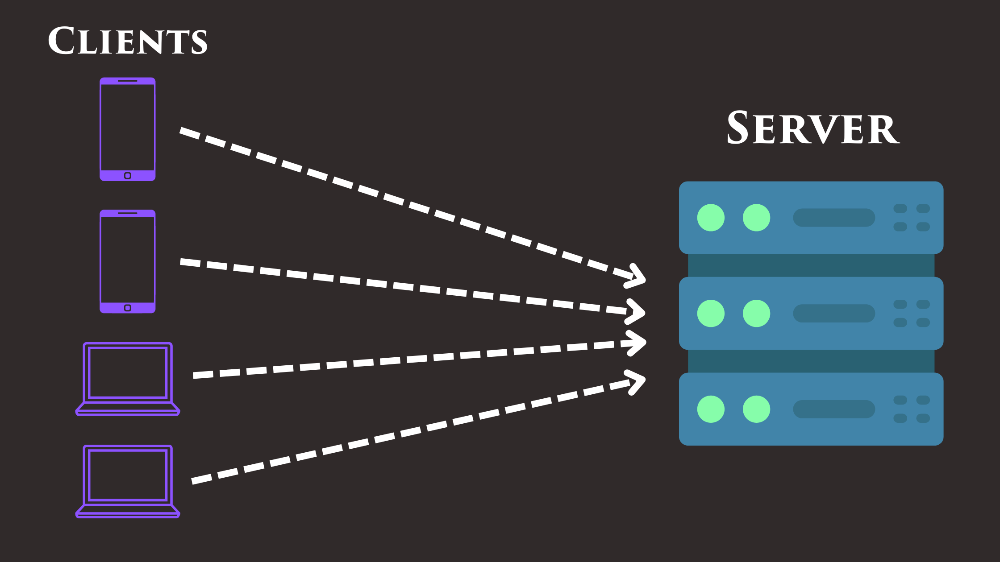

# What is a Web Server?

A web [server](https://en.wikipedia.org/wiki/Server_%28computing%29) is just a computer that serves data over a network, typically the Internet.

Servers run software that listens for incoming requests from clients. When a request is received, the server responds with the requested data.

Any server worth its salt (suspiciously looking at you Python...) can handle many requests at the same time. In Go, we do this by spawning a new [goroutine](https://go.dev/tour/concurrency) for each request.

## Building Chirpy

In this course, we'll be working on a product called "Chirpy". Chirpy is a social network similar to Twitter.

## Assignment

One of Chirpy's servers is processing requests unbelievably slowly. Figure out what's going on and fix the bug. The server should be able to process all the requests within the 1 second time limit. Notice handleRequest and handleRequests are different.
