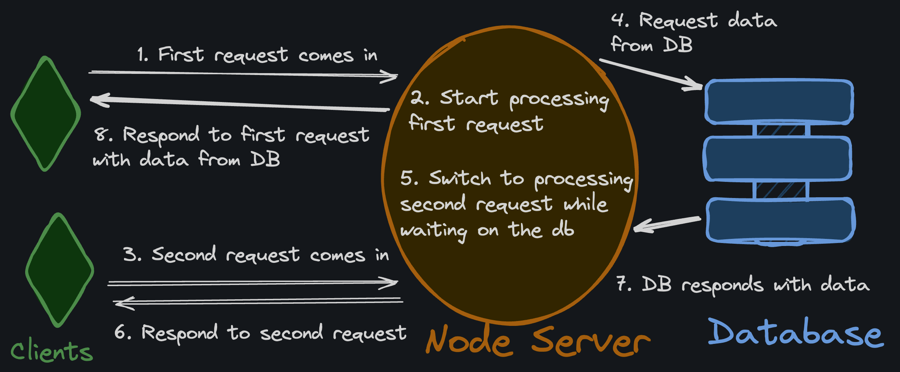

# Goroutines in Servers

In Go, _goroutines_ are used to serve _many_ requests at the same time, but not all servers are quite so performant.

Go was built by Google, and one of the purposes of its creation was to power Google's massive web infrastructure. Go's goroutines are a great fit for web servers because they're lighter weight than operating system threads, but still take advantage of multiple cores. Let's compare a Go web server's concurrency model to other popular languages and frameworks.

## Node.js / Express.js

In JavaScript land, servers are typically single-threaded. A [Node.js](https://nodejs.org/en/) server (often using the [Express](https://expressjs.com/) framework) only uses one CPU core at a time. It can still handle many requests at once by using an [async event loop](https://developer.mozilla.org/en-US/docs/Web/JavaScript/Event_loop). That just means whenever a request has to wait on I/O (like to a database), the server puts it on pause and does something else for a bit.

This might sound _horribly_ inefficient, but it's not _too_ bad. Node servers do just fine with the I/O workloads associated with most CRUD apps (Where processing is offloaded to the Database). You only start to run into trouble with this model when you need your server to do CPU-intensive work.

## Python / Django / Flask

[Django](https://www.djangoproject.com/) and [Flask](https://flask.palletsprojects.com/en/2.2.x/) are two of the most popular back-end Python frameworks. They're both built on top of the [WSGI](https://wsgi.readthedocs.io/en/latest/what.html) standard, which is a specification for how web servers and web applications should communicate.

Generally speaking, Python application code only processes a single request at a time. This means that if a request is being processed, the application won't do _anything else_ until it's finished.

The only reason this isn't completely debilitating is there is a separate WSGI process (for example [uwsgi](https://uwsgi-docs.readthedocs.io/en/latest/) ) that handles the concurrency of the application code. It can spawn multiple processes of the Python application to handle different requests at once.

In other words, `uwsgi + Flask` or `uwsgi + Django` are both needed to handle the same things that a single Node.js or Go server does _alone_.

## Takeaways

- Go servers are great for performance whether the workload is I/O _or_ CPU-bound
- Node.js and Express work well for I/O-bound tasks, but struggle with CPU-bound tasks
- Python and Django/Flask do just fine with I/O bound tasks, but frankly, no one picks Python for its performance

I'm not saying Go is always "better" than Python or JavaScript when it comes to back-end development, but it generally outperforms them when it comes to speed.

[How Do Golang Servers Stack up Against Python and Node.Js?](https://www.youtube.com/watch?v=Z-fBpdwy5aA)

---

# Quiz

Q: Which would you probably choose if you had a lot of CPU-intensive image processing back-end tasks to run?

A: Go
