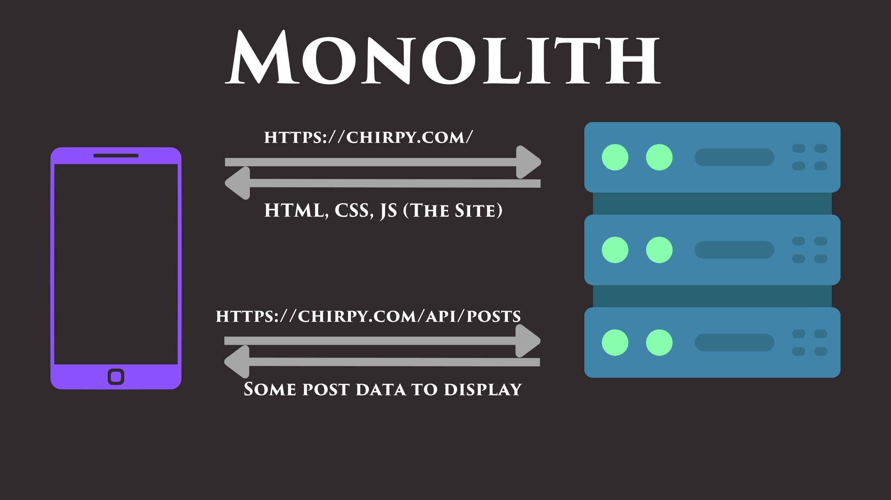
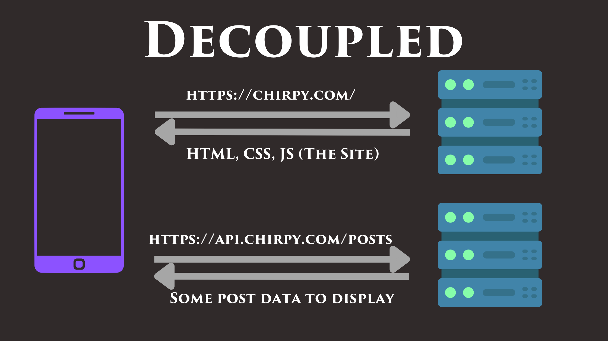

# Monoliths and Decoupling

"Architecture" in software can mean _many_ different things, but in this lesson, we're talking about the high-level architecture of a web application from a structural standpoint. More specifically, we are concerned with the separation (or lack thereof) between the back-end and the front-end.

When we talk about "coupling" in this context, we're talking about the coupling between the _data_ and the _presentation logic_ of that data. Loosely speaking, when I say "a tightly coupled front-end and back-end", what I mean is:

### Front-end: The presentation logic

If it's a web app, then this is the HTML, CSS, and JavaScript that is served to the browser which will then be used to render any dynamic data. If it's a mobile app, then this is the compiled code that is downloaded on the mobile device.

### Back-end: Raw data

For an app like YouTube, this would be videos and comments. For an app like Twitter, this might be tweets and users data. You can't embed the YouTube videos directly into the Youtube app, because a user's feed changes each time they open the app. The app downloads new raw data from Google's back-end each time the app is opened.

## Monolithic

A monolith is a single, large program that contains all of the functionality for both the front-end and the back-end of an application. It's a common architecture for web applications, and it's what we're building here in this course.

Sometimes monoliths host a REST API for raw data (like JSON data) within a subpath, like `/api` as shown in the image. That said, there are even more tightly coupled kinds of monoliths that inject the dynamic data directly into the HTML as well. The nice thing about separate data endpoints is that they can be consumed by any client, (like a mobile app) and not just the website. That said, injection is typically more performant, so it's a trade-off. WordPress and other web*site* builders typically work this way.

## Decoupled

A "decoupled" architecture is one where the front-end and back-end are separated into different codebases. For example, the front-end might be hosted by a static file server on one domain, and the back-end might be hosted on a subdomain by a different server.

Depending on whether or not a load balancer is sitting in front of a decoupled architecture or not, the API server might be hosted on a separate domain (as shown in the image) _or_ on a subpath, as shown in the monolithic architecture. A decoupled architecture allows for either approach.

## Assignment

For now, Chirpy is _technically_ a monolith. That said we _are_ keeping all the API logic decoupled in the sense that it will be served from its own namespace (path prefix). We serve the website from the `app` path, and we'll be serving the API from the `/api` path.

Let's move our non-website endpoints to the `/api` namespace in our routing.

To do this, prepend `/api` to the beginning of each of our API endpoints, e.g. `/api/healthz` and `/api/metrics`

## Tests:

1. GET /api/reset
   1. Expecting status code: 200
2. GET /app
   1. Expecting status code: 200
   2. Expecting body to contain: Welcome to Chirpy
3. GET /app/assets/
   1. Expecting status code: 200
   2. Expecting body to contain: <a href="logo.png">logo.png</a>
4. GET /api/metrics
   1. Expecting status code: 200
   2. Expecting body to contain: Hits: 2
5. GET /api/healthz
   1. Expecting status code: 200
   2. Expecting body to contain: OK
